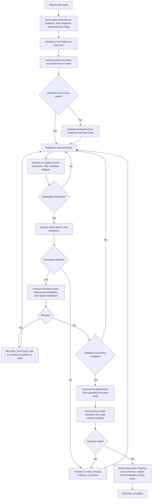

# Plan Tracking Issue Workflow V1

## Status

- Status: implemented; canonical design
- Date: 2026-05-26
- Depends on:
  - `docs/source/plan-issue-redesign/plan-tracking-issue-comment-taxonomy-v1.md`
  - `docs/source/plan-issue-redesign/plan-tracking-issue-run-state-controller-v1.md`
  - `docs/source/plan-issue-redesign/plan-issue-skill-family-redesign-v1.md`
- Scope: lightweight plan-tracking issues with `profile=tracking`

## Purpose

This document defines when agents should write plan-tracking issue lifecycle
comments, how those comments move the issue through execution states, and how to
avoid noisy or inconsistent progress reporting.

The workflow is intentionally checkpoint-based. Agents should not comment for
every file edit. They should comment when issue-visible truth changes.

The preferred execution model is:

1. Keep provider lifecycle comments as durable truth.
2. Keep local execution details in typed `run-state.json` under the
   `plan-issue` state-dir.
3. Use `plan-issue tracking status` to reconcile issue truth and run state.
4. Use `plan-issue tracking checkpoint` to post state/session/validation
   comments when the reconciled FSM says a checkpoint is useful.

## State Model

| State | Meaning | Required latest evidence |
| --- | --- | --- |
| `RECORD_UNOPENED` | No provider issue exists for the plan bundle. | none |
| `RECORD_OPEN_INITIAL` | Issue exists with source, plan, and initial state. | `source`, `plan`, `state` |
| `RECORD_OPEN_ACTIVE` | Work has started or the state has progressed beyond the initial snapshot. | `source`, `plan`, latest `state`, optional `session` |
| `RECORD_BLOCKED` | Work cannot proceed without external input or an external state change. | latest `state` with `status=blocked`; optional `session` |
| `RECORD_VALIDATING` | Implementation scope is complete enough to validate. | latest complete or in-progress `state`, latest `validation` |
| `RECORD_REVIEWED` | Review evidence exists and blocking findings are resolved or dispositioned. | latest `review` |
| `RECORD_READY_FOR_CLOSE` | Strict closeout gates should pass. | complete `state`, `session`, passing `validation`, acceptable `review`, linked PR and approval evidence |
| `RECORD_CLOSED` | `record close` posted closeout evidence, repaired dashboard, and closed the provider issue. | `closeout` |

`RECORD_BLOCKED` is a workflow state for agent behavior. It maps to a latest
`state` payload with `status=blocked`; `plan-issue record` can still report the
underlying issue as open.

## Runtime Controller Model

The workflow has two state layers:

- Issue FSM state: derived from provider lifecycle comments through
  `record audit` and visible-completeness checks.
- Local run state: stored in
  `<state-dir>/out/plan-issue-delivery/<repo-slug>/issue-<n>/runs/<run-id>/run-state.json`.

The controller reconciles those layers before posting comments:

| Input | Example | Controller use |
| --- | --- | --- |
| Issue evidence | latest `state`, `session`, `validation`, `review` comments | Determines durable FSM state and closeout readiness. |
| Plan bundle | source, plan, execution-state Markdown | Validates local files and renders state comments. |
| Run state | selected task, branch, PR, validation artifacts | Builds candidate checkpoint payloads. |
| Event journal | `events.jsonl` | Supports resume, debugging, and checkpoint provenance. |
| Provider PR evidence | linked PR state, merge SHA, checks | Supports close-ready and closeout gates. |

Provider issue evidence wins over local run state. If issue evidence is newer,
the controller must report stale run state and refuse live checkpoint writes
until the run state is synchronized or explicitly repaired.

## Lifecycle Diagram



## Comment Timing Rules

### Opening

Use `record open` or `record attach` when the plan bundle is ready:

- Source or review document exists.
- Plan document exists and validates.
- Execution-state document exists and contains `## Execution State` and
  `## Task Ledger`.
- Source, plan, and execution state are committed or the caller is explicitly
  in dry-run / repair mode.

Comments written:

- `source`
- `plan`
- initial `state`

Dashboard action:

- `record open` or `record attach` repairs the dashboard after initial comments.

Run-state action:

- Initialize local run state after live issue creation or attach:

```bash
plan-issue tracking run init \
  --repo "$OWNER_REPO" \
  --issue "$ISSUE" \
  --bundle "$PLAN_BUNDLE" \
  --task "$TASK_ID" \
  --branch "$BRANCH" \
  --format json
```

### Scope Selection Before Edits

Before implementation, update the issue only if the latest issue-visible state
does not already show the selected task, current status, branch, or next action.

Comments written:

- `state` with `--task-ledger-display collapsed`

Preferred controller path:

```bash
plan-issue tracking checkpoint \
  --repo "$OWNER_REPO" \
  --issue "$ISSUE" \
  --run-state "$RUN_STATE" \
  --post state \
  --repair-dashboard \
  --format json
```

Do not write:

- `session`, unless meaningful investigation already happened.
- `validation`, unless validation actually ran.

### Implementation Checkpoints

Post a checkpoint when one of these changes:

- Current task or sprint changed.
- A task row moved to `in-progress`, `done`, `deferred`, or `blocked`.
- A PR was opened, updated, merged, closed, or replaced.
- A blocker was discovered, removed, or converted to follow-up.
- The next agent would make a wrong decision from the previous issue state.
- The session is ending and useful handoff context exists.

Comments written:

- `session` when there is useful work-session context.
- `state` after updating the canonical execution-state file.

Run-state action:

- Record local changes first with `tracking run update`.
- Run `tracking status` before live checkpoint posting when provider evidence
  may have changed.

Dashboard action:

- Run `record repair-dashboard` after the lifecycle comment write.

Do not comment when:

- Only local scratch notes changed.
- Only a file was edited and the task status did not change.
- A command is still running and no decision can be made.
- The comment would only repeat the current dashboard.

### Validation Checkpoints

Post validation when command results materially affect the issue state:

- A validation command failed and blocks progress.
- A partial validation run is the strongest available evidence before handoff.
- Required validation passed for the selected scope.
- Final validation passed before closeout.

Comments written:

- `validation`
- `state` if the validation result changes status, blockers, task rows, or next
  action.

Preferred controller path:

```bash
plan-issue tracking run update \
  --run-state "$RUN_STATE" \
  --phase validating \
  --validation-command "$COMMAND" \
  --validation-status "$STATUS" \
  --validation-evidence "$EVIDENCE" \
  --format json

plan-issue tracking checkpoint \
  --repo "$OWNER_REPO" \
  --issue "$ISSUE" \
  --run-state "$RUN_STATE" \
  --post state,validation \
  --repair-dashboard \
  --format json
```

Dashboard action:

- Run `record repair-dashboard` after the validation comment.

Validation grouping:

- Group related commands into one validation comment.
- Use separate validation comments when the status changes from fail to pass or
  when a different validation scope is being recorded.

### Review Checkpoints

Post review when the PR review gate or equivalent review evidence exists.

Comments written:

- `review`
- `state` if findings change task status, blockers, or next action.

Run-state action:

- Record review decision and retained evidence in run state before checkpoint.
- Use checkpoint to post review evidence only after findings are classified.

Review must include:

- Decision.
- Review lenses.
- Findings and dispositions.
- Outcome comment URL or retained evidence path when available.

### Final State Before Closeout

Before `record close`, post a final state comment when the latest state comment
is not already final and expanded.

Required final state:

- `status=complete`.
- Every task is `done` or `deferred`.
- Deferred tasks have a reason or follow-up note in the visible ledger.
- Linked PRs are current.
- Validation and review evidence links are current.
- Task Ledger is expanded, not collapsed.

Command shape:

```bash
plan-issue tracking checkpoint \
  --repo "$OWNER_REPO" \
  --issue "$ISSUE" \
  --run-state "$RUN_STATE" \
  --post state \
  --final-state \
  --repair-dashboard \
  --format json
```

### Closeout

Use `record close` only after the closeout gate should pass.

Preferred preflight:

```bash
plan-issue tracking close-ready \
  --repo "$OWNER_REPO" \
  --issue "$ISSUE" \
  --run-state "$RUN_STATE" \
  --linked-pr "$OWNER_REPO#$PR_NUMBER" \
  --approval "$APPROVAL" \
  --expect-visible \
  --format json
```

`record close` owns:

- Closeout gate audit.
- Linked PR provider verification.
- Closeout comment.
- Final dashboard repair.
- Provider issue close.

Do not hand-post a closeout comment. If closeout fails, leave the issue open and
record the exact unblock action through `state`, `session`, or `validation` as
appropriate.

## Sprint, Task, And Session Granularity

Use these rules to decide comment granularity:

- Sprint boundaries deserve issue-visible state when they change the plan's
  active scope.
- Task boundaries deserve issue-visible state when a task changes status or
  ownership.
- A session comment is appropriate for a meaningful work block, not for every
  task row.
- A validation comment is appropriate for a coherent validation checkpoint, not
  every command line in isolation.
- Review and closeout comments should be sparse and gate-driven.

Recommended minimum issue timeline for a small one-PR tracking issue:

1. `source`, `plan`, initial `state` from `record open`.
2. `tracking run init` creates local run state.
3. One collapsed `state` checkpoint when implementation scope is selected, if
   not already visible.
4. One `session` checkpoint after meaningful implementation work.
5. One `validation` checkpoint for final validation.
6. One `review` checkpoint when review is required.
7. One final expanded `state` checkpoint.
8. One `closeout` from `record close`.

Larger issues may repeat `session`, `state`, and `validation` at meaningful
checkpoints. They should not repeat `source` or `plan` unless the governing
source or plan intentionally changes.

## Status And Task Semantics

Execution state status:

- `in-progress`: work is active or ready for the next implementation action.
- `blocked`: progress requires user input, provider state, release state, auth,
  CI, or another external change.
- `complete`: selected issue scope is done and ready for closeout checks.

Task row status:

- `pending`: not started.
- `in-progress`: currently being worked.
- `done`: completed and validated to the level required by the plan.
- `deferred`: intentionally not completed in this issue; must include reason or
  follow-up evidence.

Closeout readiness requires:

- State status `complete`.
- Every task row `done` or `deferred`.
- No unresolved blocker.
- Passing validation or an explicit accepted waiver in validation evidence.
- Review decision `approve` or `comments-only` with no unresolved blocker or
  major residual findings.
- Linked PRs merged when PR evidence is required.
- Approval evidence available.

## Agent Decision Checklist

Before posting any lifecycle comment, the agent should answer:

1. Did issue-visible truth change?
2. Which lifecycle role owns that truth?
3. Is the canonical local source updated first?
4. Will the visible template contain useful human-readable evidence?
5. Will this comment help the next agent or reviewer make a decision?
6. Should the dashboard be repaired immediately after this write?

If the answer to 1 or 5 is no, do not post a lifecycle comment.

When the run-state controller is available, the agent should ask the CLI first:

```bash
plan-issue tracking status \
  --repo "$OWNER_REPO" \
  --issue "$ISSUE" \
  --run-state "$RUN_STATE" \
  --expect-visible \
  --format json
```

If `recommended_next_action.kind` is `none`, do not post. If the status reports
stale run state, reconcile before posting.

## Failure Handling

If a lifecycle write fails:

- Do not compose a raw provider comment as a replacement.
- Keep the local execution-state file accurate.
- Keep `run-state.json` accurate, but do not treat it as more authoritative
  than provider lifecycle comments.
- Preserve command output in an `agent-out` project directory when useful.
- Report the stable error code or exact command failure.
- Retry through `plan-issue record` after the input is fixed.

If a comment renders Profile-only:

- Treat it as a failed lifecycle write.
- Do not claim progress, validation, review, or closeout readiness from that
  comment.
- Fix the renderer, payload, or template source before proceeding.
